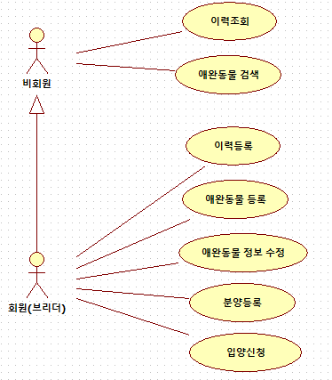
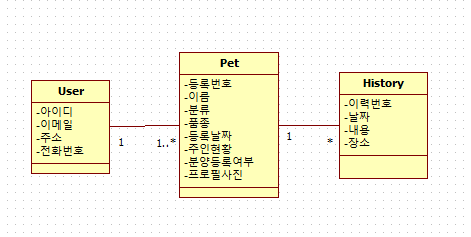

# Collathon 2018

충남대학교 컴퓨터공학과 모션 동아리에서 주최하는 Collathon 대회 프로젝트

> # Environment
> Intellij IDE / Java 8
> Spring boot 2.0.3 (Spring 5.0.7)
> DB : dev H2 database / prod MySQL 8.0.11
> Thymeleaf Template Engine

> # Member
> - 박경철 (팀장, 개발자)
> - 장종원 (기획자)
> - 김진현 (디자이너)
> - 정재성 (기획자, 개발자)

## Overview

```
펫팸족(Pet+Family) 100만, 반려동물 수 1000만 시대가 도래 했다.

1인 가구 증가, 인구 고령화, 혼족 등이 증가함에 따라 취미삼아 기르던 애완동물이 삶을 나누는 반려동물로 인식되며 1인 가구의 필수 가족 구성원으로 자리잡아 가고 있다.

반려동물 분양에 대한 관심 또한 크게 증가 하여 반려동물 분양 시 어떤 종의 어떤 브리더에게서 분양 받았으며 어떻게 사는지, 어떤 성격과 어떤 특성의 종이 만나 자신의 반려동물로 되었는지, 아니면 분양 해 주었던 자신의 반려견의 후손들이 어떻게 살고 있는지에 대한 호기심을 갖는 사람들 또한 증가 하고 있다.

이에 따라 반려동물의 혈통 및 족보를 추적해주고 지금 현황을 알려주며, 분양까지 알선 해 주는 서비스를 개발하고자 한다.
```

## 기능

#### 1. 이력 조회

```
actor (행위자) : 비회원, 회원
supporter (조력자) : -
pre-condition (선행 조건) : 애완동물 세부 정보 페이지에 접근한다.  
post-condition (후행 조건) : -

시나리오
1. 행위자가 이력 조회를 위한 UI를 클릭한다.
2. 해당 애완동물의 이력들이 나타난다.

대안 상황

예외 상황

```

#### 2. 애완동물 검색

```
actor (행위자) : 비회원, 회원
supporter (조력자) : -
pre-condition (선행 조건) : actor가 검색페이지에 접근한다.
post-condition (후행 조건) : -

시나리오
1. 검색창에 검색 조건을 고르고 키워드를 입력한다.
2. 검색을 한다. 
3. 검색 결과가 나타난다.

대안 상황

예외 상황

- 검색 결과가 없을 때

검색 결과가 없다는 메세지를 페이지에 띄운다.
 
```

#### 3. 입양 신청

```
actor (행위자) : 회원
supporter (조력자) : 
pre-condition (선행 조건) : 애완동물 프로필 페이지에 접근한다.  
post-condition (후행 조건) : 입양 신청 알림이 해당 애완동물의 주인에게 간다.

시나리오
1. actor가 입양 신청을 위한 UI를 클릭한다.
2. 해당 애완동물의 정보가 나타나며 다시 한번 actor에게 확인을 요청한다.
3. 확인을 누른다.

대안 상황

- 취소를 누를 경우

입양 신청이 취소된다.

예외 상황

- 로그인이 안 된 경우

1. 로그인이 되지 않았다는 메세지를 띄워준다.
2. 로그인 페이지로 이동한다.
```
#### 4. 이력 등록

```
actor (행위자) : 회원
supporter (조력자) : 
pre-condition (선행 조건) : 애완동물이 등록돼있어야 한다.     
post-condition (후행 조건) :

시나리오
1. actor가 이력 등록을 위한 UI를 클릭한다.
2. 등록 칸에 이력 정보를 입력한다.
3. 확인을 누른다.

대안 상황

- 취소를 누를 경우

이력 등록이 취소된다.

예외 상황

```

#### 5. 애완동물 등록

```
actor (행위자) : 회원
supporter (조력자) : 
pre-condition (선행 조건) :  
post-condition (후행 조건) :

시나리오
1. actor가 애완동물 등록을 위한 UI를 클릭한다.
2. 애완동물 정보 등록 칸에 각종 정보를 입력한다.
3. 확인을 누른다.

대안 상황

- 취소를 누를 경우

1. 애완동물 등록이 취소된다.
2. 초기 페이지로 돌아간다.

예외 상황

- 로그인이 안 된 경우

1. 로그인이 되지 않았다는 메세지를 띄워준다.
2. 로그인 페이지로 이동한다.
```
#### 6. 애완동물 정보 수정

```
actor (행위자) : 회원
supporter (조력자) : 
pre-condition (선행 조건) : 애완동물이 등록돼있어야 한다.  
post-condition (후행 조건) :

시나리오
1. actor가 정보 수정을 위한 UI를 클릭한다.
2. 해당 애완동물의 현재 정보와 수정을 위한 칸이 나타난다.
3. 수정하고 싶은 애완동물의 정보를 수정 칸에 입력한다.
3. 확인을 누른다.

대안 상황

- 취소를 누를 경우

1. 정보 수정이 취소된다.
2. 애완동물 프로필 페이지로 이동한다.

예외 상황

```
#### 7. 애완동물 분양 등록

```
actor (행위자) : 회원
supporter (조력자) : 
pre-condition (선행 조건) : 애완동물이 등록돼있어야 한다.  
post-condition (후행 조건) : 애완동물 프로필에 분양 등록을 위한 UI가 나타난다.

시나리오
1. actor가 분양 등록을 위한 UI를 클릭한다.
2. 해당 애완동물의 정보가 나타나며 다시 한번 actor에게 확인을 요청한다.
3. 확인을 누른다.

대안 상황

- 취소를 누를 경우

분양 등록이 취소된다.

예외 상황
```

### Use-Case Diagram



## UI 설계


> ※ 위 컨셉으로 페이지 구성을 할 예정

## DB 설계



> ### ※ Pet 클래스의 분류와 품종 차이

> 분류는 개 / 고양이 / 햄스터 등 동물의 종류를 의미
> 품종은 각각 동물마다 가지고 있는 혈통을 의미 ex) 개의 경우 치와와 / 푸들 등
