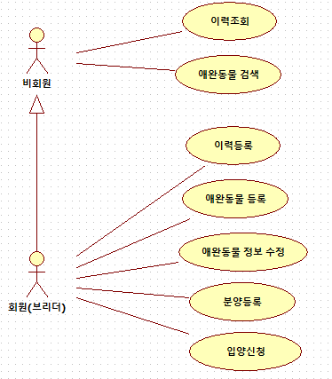
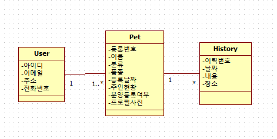

# Collathon 2018

충남대학교 컴퓨터공학과 모션 동아리에서 주최하는 Collathon 대회 프로젝트

> # Environment
> Intellij IDE / Java 8
> Spring boot 2.0.3 (Spring 5.0.7)
> DB : dev H2 database / prod MySQL 8.0.11
> Thymeleaf Template Engine

> # Member
> - 박경철 (팀장, 개발자)
> - 장종원 (기획자)
> - 김진현 (디자이너)
> - 정재성 (기획자, 개발자)

## Overview

```
펫팸족(Pet+Family) 100만, 반려동물 수 1000만 시대가 도래 했다.

1인 가구 증가, 인구 고령화, 혼족 등이 증가함에 따라 취미삼아 기르던 애완동물이 삶을 나누는 반려동물로 인식되며 1인 가구의 필수 가족 구성원으로 자리잡아 가고 있다.

반려동물 분양에 대한 관심 또한 크게 증가 하여 반려동물 분양 시 어떤 종의 어떤 브리더에게서 분양 받았으며 어떻게 사는지, 어떤 성격과 어떤 특성의 종이 만나 자신의 반려동물로 되었는지, 아니면 분양 해 주었던 자신의 반려견의 후손들이 어떻게 살고 있는지에 대한 호기심을 갖는 사람들 또한 증가 하고 있다.

이에 따라 반려동물의 혈통 및 족보를 추적해주고 지금 현황을 알려주며, 분양까지 알선 해 주는 서비스를 개발하고자 한다.
```

## 기능

#### 1. 이력 조회

#### 2. 애완동물 검색

#### 3. 입양 신청

#### 4. 이력 등록

#### 5. 애완동물 등록

#### 6. 애완동물 정보 수정

#### 7. 애완동물 분양 등록

### Use-Case Diagram



## UI 설계


> ※ 위 컨셉으로 페이지 구성을 할 예정

## DB 설계



> ### ※ Pet 클래스의 분류와 품종 차이
> 분류는 개 / 고양이 / 햄스터 등 동물의 종류를 의미
> 품종은 각각 동물마다 가지고 있는 혈통을 의미 ex) 개의 경우 치와와 / 푸들 등
